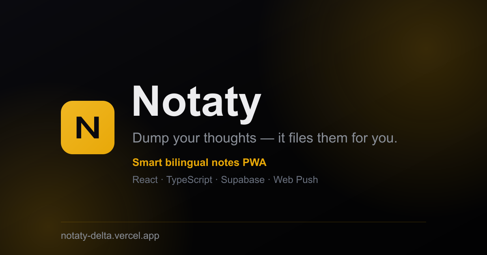

# Notaty

A notes app that reads free-form text — in English or Arabic — decides what each note *is*
(a task, a reminder with a due time, a shopping list, a saved video link, a recurring chore…),
and files it accordingly. Installable as a PWA; sends real push reminders.

**Live:** https://notaty-delta.vercel.app

<p align="center"></p>

> Note: currently the live URL opens a sign-in screen (see [Guest mode](#status)). To evaluate the
> app without an account, clone and run it — it boots straight into an on-device demo mode.

## Stack

| Layer | Choice |
|-------|--------|
| Frontend | React 18, TypeScript, Vite, Tailwind CSS |
| Offline / install | `vite-plugin-pwa` (Workbox service worker) |
| Backend / DB / Auth | Supabase — Postgres, Auth, Row-Level Security, `pg_cron` + `pg_net` |
| Serverless | Vercel functions (`/api/*`) |
| Push | Web Push (VAPID) via `web-push` |
| Hosting / CI | Vercel (GitHub → auto-deploy) |

~3,200 lines of application code · 17 components · 3 hooks · 5 tables + 1 view · zero runtime UI dependencies beyond React.

## Architecture

```
React PWA ──► on-device parser (lib/parser.ts)    installable, offline (Workbox SW)
    │
    ▼
 Supabase  ── Postgres + Row-Level Security + Auth   private per user, synced
    ▲
    │         Vercel serverless functions
 iOS Shortcut ─► /api/save       ingest a shared link (per-user capability token)
 pg_cron ──────► /api/cron       due reminders · weekly digest · overdue cycles
                 /api/push-test  send a Web Push to your devices
                 └─ web-push / VAPID ─► installed PWAs
```

### Decisions worth explaining

**The parser is the product, and it runs on the client.** `src/lib/parser.ts` (~430 LOC, no
dependencies) classifies each note into one of 11 types and extracts a due date/time, priority and
tags from plain text. Type detection is ordered — reminders before events before tasks — so
`ذكرني بكرا الساعة وحدة` becomes a reminder due tomorrow at 13:00, while `team meeting Thursday 3pm`
becomes an event. It parses **Arabic** natural language directly: imperative verbs, weekday names
including preposition-fused forms (`للجمعة`), spelled-out clock times (`الساعة وحدة`, `ثنتين ونص`,
`الا ربع`), and a trailing `✅` that marks a note done. Keeping this on-device (vs. an LLM call)
makes classification instant, free, offline-capable and private.

**One data layer, two backends.** `src/lib/db.ts` exposes a single async API and transparently
targets either Supabase or `localStorage`, chosen at load time by whether Supabase env keys are
present (`isCloud`). This is what makes the local demo mode and the cloud app the same code path.

**Optimistic UI with server reconciliation.** `useNotes` mutates React state immediately on
add/update/delete, then persists; inserts use the row returned by Postgres so the client picks up
server-generated fields (`id`, timestamps). Ordering and "days since" are computed in SQL, not the
client.

**Push without a native app.** iOS Safari only allows Web Push for home-screen-installed PWAs, so
the SW registers push/notification handlers (`public/push-sw.js`, injected into the Workbox build),
the client subscribes with a VAPID key, and a Postgres `pg_cron` job pings a Vercel function that
sends the actual notifications and records `reminded_at` to avoid duplicates.

**Sharing into the app.** iOS PWAs can't register as share targets, so an Apple Shortcut POSTs the
shared link to `/api/save` with a per-user, capability-scoped token — the endpoint attributes the
save to the right account (via the service-role key, server-side only) without ever exposing user
credentials.

**Security model.** Every table has Row-Level Security keyed on `auth.uid()`; the browser only ever
holds the public anon key. The service-role key and VAPID private key live exclusively in server env
vars. `since_items_status` is a `security_invoker` view so it inherits the caller's RLS.

## Running locally

```bash
npm install
npm run dev        # http://localhost:5173 — starts in on-device demo mode, no account needed
```

For cloud mode, create a free [Supabase](https://supabase.com) project, run
[`schema.sql`](schema.sql) in its SQL editor (tables + RLS + view), and add your Project URL and
anon key to `.env.local` (template in [`.env.example`](.env.example)). Build with `npm run build`.

## Project structure

```
src/lib/parser.ts     bilingual NLP engine (types, dates/times, priority, tags)
src/lib/db.ts         data layer (Supabase ↔ localStorage), auth, CRUD
src/lib/since.ts      recurring-cycle tracker
src/hooks/            useAuth · useNotes · useSince
src/components/       Composer, NoteCard, section views, setup modals
api/                  Vercel functions: save · cron · push-test
public/push-sw.js     Web Push service-worker handlers
schema.sql            Postgres tables, RLS policies, status view
```

## Status

Personal project, single developer. Honest current gaps: no automated tests yet; the deployed
instance requires sign-up (a guest/demo mode is on-device only when self-hosted); a few product
integrations (Instagram caption fetch, Google Calendar sync) are intentionally deferred in favor of
lighter-weight paths (`.ics` export, manual filing).

## License

MIT © [Tamer Adawi](https://github.com/TamerAdawi)
